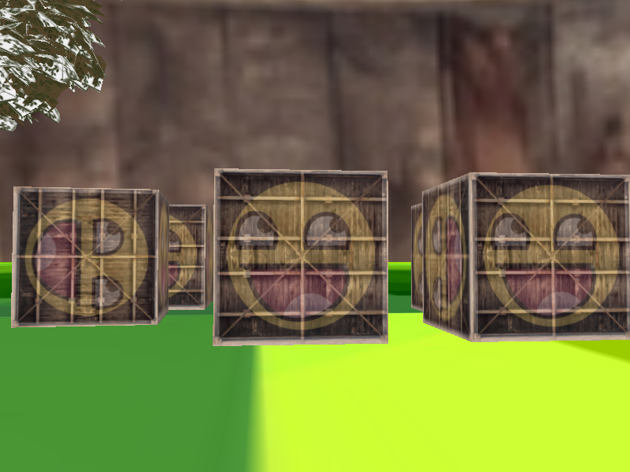
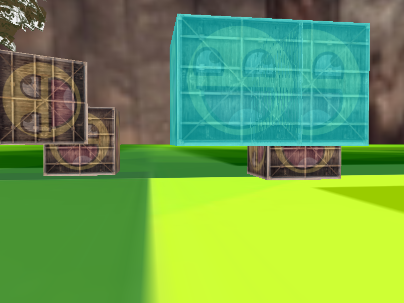

#### 简单场景的显示与漫游

##### 程序编译运行环境

- IDE：`Visual Studio 2019`
- 链接库：链接libs目录下`glfw3.lib`，`assimp.lib`

- 头文件：包含`include`头文件目录
- 动态库：`assimp.dll`放置可执行文件目录下

使用Visual Studio打开项目运行即可


##### 场景构建


场景包括两个加载的模型，分别为中间的树和包围的球形木屋，支持obj文件的加载，同时包含两个静止3d木箱，三个动态3d木箱。

程序支持自定义场景文件的保存，读入和加载，自定义场景文件格式如下图

```
v 2 3 // 表示是一个绘制物体，有2个纹理，3个顶点
t t // 表示纹理编号
x y z t1 t2 // 表示顶点1
x y z t1 t2 // 表示顶点2
x y z t1 t2 // 表示顶点3
M m // 表示是一个obj绘制模型，模型名为m
t t t // 表示视角平移变换
s s s // 表示视角缩放变换
```

程序默认运行时会将场景文件保存在`model.txt`中，可将`main`函数中以下部分反注释掉以运行读取场景文件`model.txt`进行渲染。

    {
        // load();
        // return 0;
    }


##### 场景漫游

支持相机位置的移动，视线方向以及视角大小的改变，使用`W`键前进，`S`键后退，`A`键左移，`D`键右移，鼠标左右上下移动控制视线方向对应的改变，鼠标滚轮可控制视角大小的放大和缩小。


##### 碰撞检测

使用AABB进行碰撞检测，如下图，在碰撞时，两个木箱会显示为青色。

未碰撞时



碰撞时




##### 滤镜

使用帧缓冲实现反相滤镜，如下图


